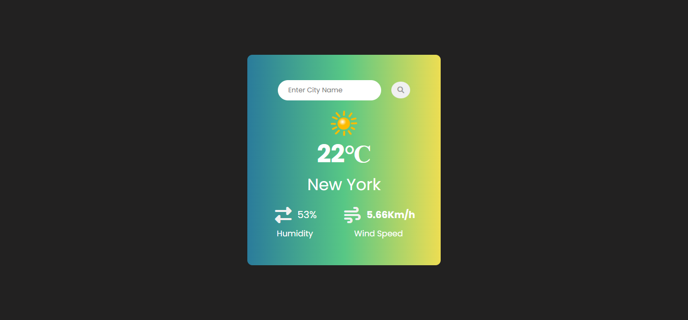

# Weather-App

A simple weather app for getting real time weather updates.

## 🚀 Features

- Real time temperature updates.
- Location wised search functionality.
- Dynamic icons according to weather updates.
- Temperature can be seen as Celsius aur Fahrenheit both.
- Proper alerts on every wrongly typed city.

## Description

#### Ek simple aur elegant Weather Application jo WeatherAPI ka use karke kisi bhi city ka real-time temperature aur weather conditions dikhati hai. Isme responsive design aur dynamic icons ka use kiya gaya hai.

## 🛠️ Tech Stack

| Technology     | Use Case                                            |
| :------------- | :-------------------------------------------------- |
| **HTML5**      | For structure and semantic layout.                  |
| **CSS3**       | For interactive design and styling                  |
| **JavaScript** | For Fetch API aur Async/Await and DOM manipulation. |
| **WeatherAPI** | Live weather data sourcing.                         |

## 📦 Installation & Setup

Project ko local machine par chalane ke liye niche diye gaye steps follow karein:

Repository Clone karein:

```Bash
git clone https://github.com/your-username/weather-app.git
```

Project Folder mein jayein:

```Bash
cd weather-app
```

API Key Setup:
config.js file mein apni API key enter karein:

```JavaScript
const CONFIG ={
  API_KEY : "xyz example key"
}

export default CONFIG;
```

Run karein:
`index.html` file ko browser mein open karein (Preferably using Live Server).

---

## 📁 Project Structure

```text
├── index.html          # Main HTML structure
├── style.css           # Styling aur Animations
├── script.js           # API calls aur UI Logic
├── assets/             # Images aur default icons
└── README.md           # Project Documentation
```

## 📸 Screenshots

